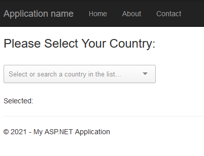
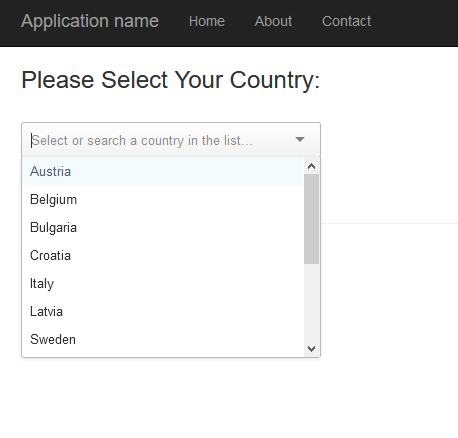
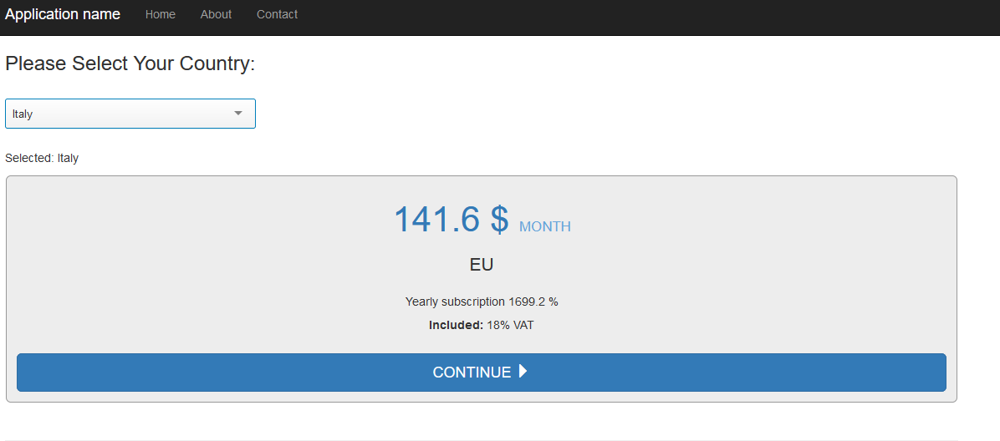
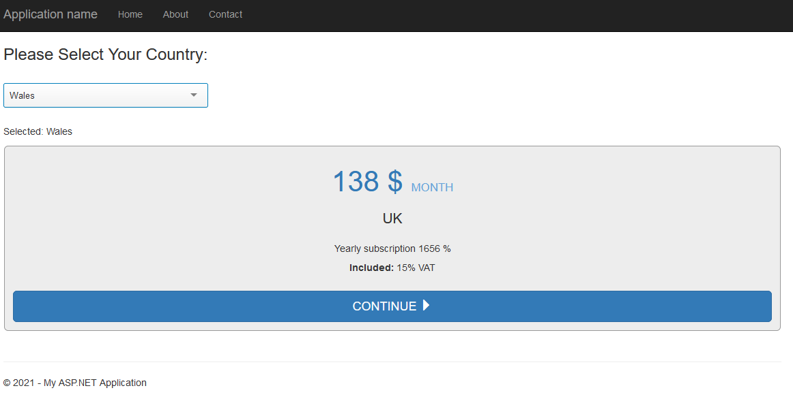

# saas_platform_subcription

In this Project it has been used Multiple Technologies.

*Entity Framework

*LINQ

*MS SQL

*AngularJs

*CSS

============================================

In pictures above you can see it is used ui-select from AngularJs for selection of countries stored in database

============================================

After selection the country the subscription is selected automaticly calculating VAT of region as shown in pictures below,

Different VAT for UK and EU

============================================

To Store the data in is used MS SQL SERVER with code first migration.

NOTE: If neccessery I can send the Database seperatly.

THANK YOU!
